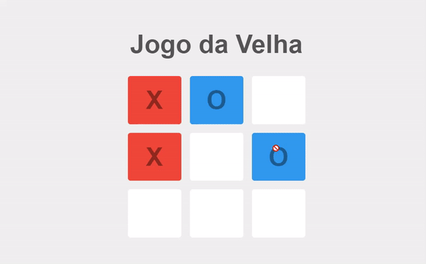
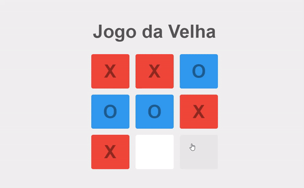
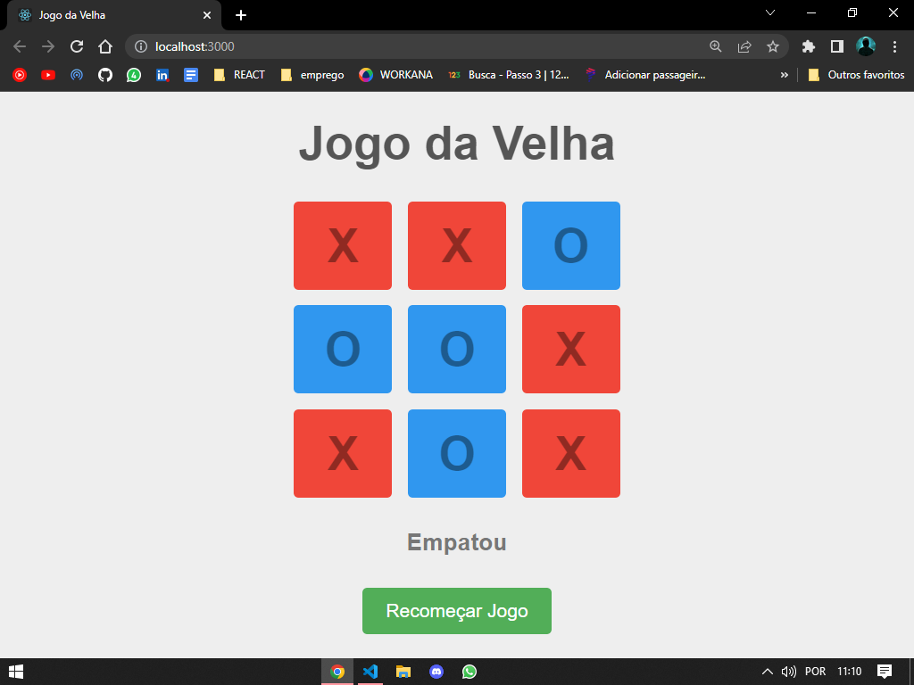

# 🔴JOGO DA VELHA🕹
O clássico, simples e divertido jogo da velha agora foi implementado por mim!
Espero que seja divertido!

## 🎈Demonstração

A seguir faço uma breve simulação de uma partida onde o X sai vencedor:

Aqui mostro também um jogo onde termina em empate:

## 🔍Parte técnica
Tecnologias utilizadas: HTML/CSS, JS e REACTjs.
Optei por não separar a aplicação em diversos componentes, visto que seria um projeto rápido e sem muitos problemas!

### 🎁ADICIONAIS

